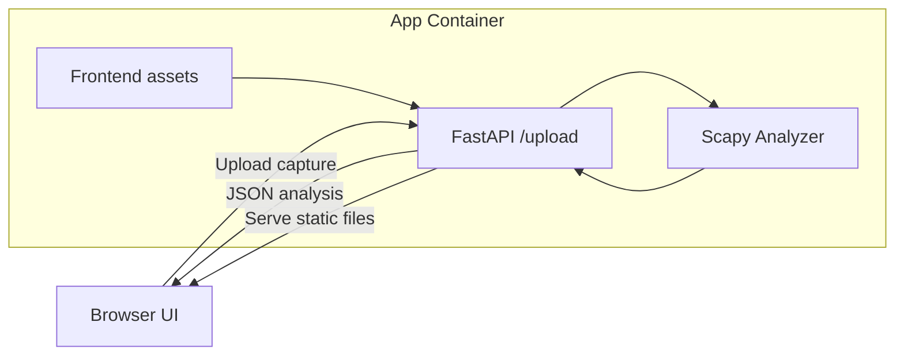
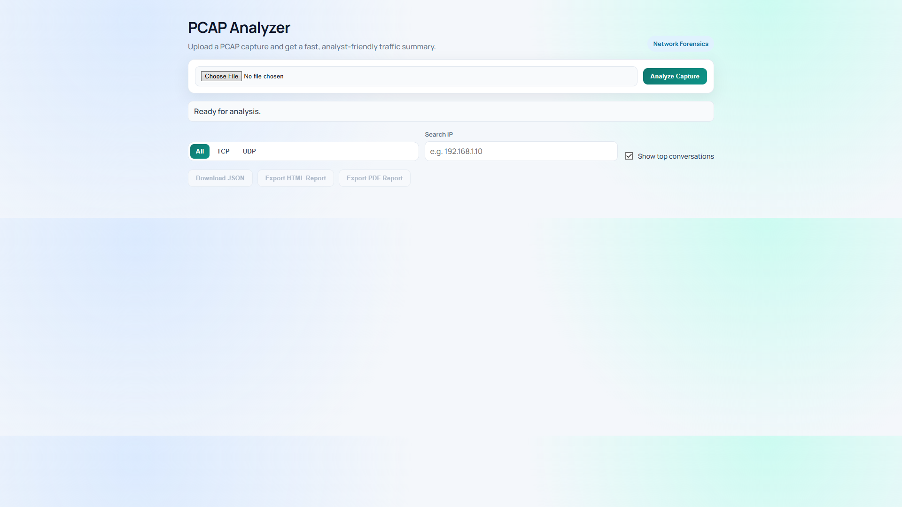
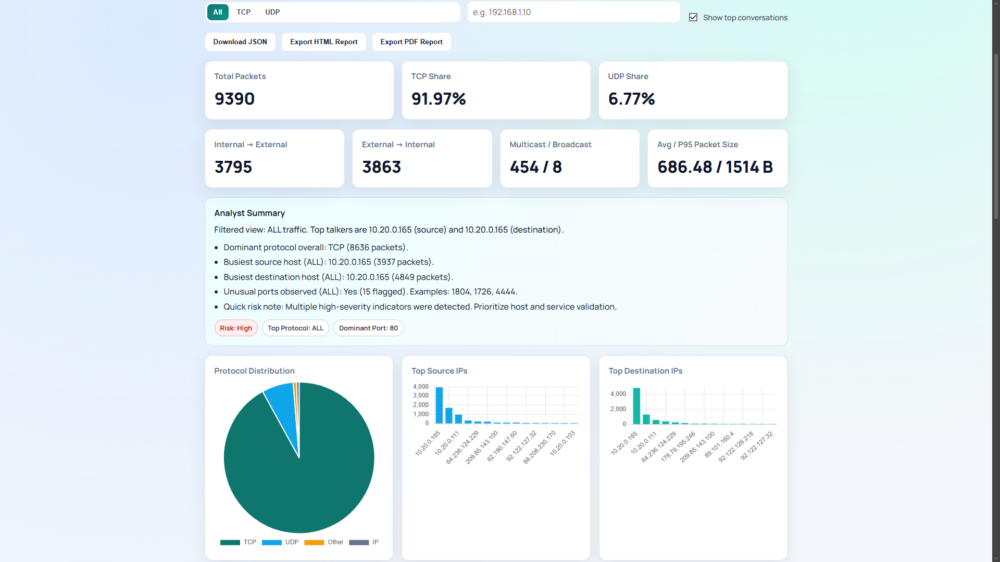

# PCAP Analyzer

PCAP Analyzer is a deployable web application for packet-capture analysis. It provides a FastAPI backend, a browser dashboard, and export workflows for JSON, HTML, and PDF reports.

## Features

- Upload .pcap and .pcapng captures
- Protocol metrics (TCP/UDP share, protocol distribution)
- Host and conversation analysis (top source/destination IPs, top pairs)
- Port intelligence (top ports, suspicious ports, port class distribution)
- Traffic scope analytics (internal/external, multicast, broadcast)
- Packet size statistics (avg, p50, p95)
- Analyst Summary panel with risk context
- Exports: JSON, HTML report, PDF report (no popup flow)

## Architecture



## Project Layout

- backend/main.py: API entrypoint and static-file serving
- backend/analyzer.py: packet parsing and analysis logic
- backend/requirements.txt: Python dependencies
- frontend/index.html: dashboard structure
- frontend/app.js: UI logic and export actions
- frontend/styles.css: dashboard styling
- run.sh: local launcher
- Dockerfile: production container build

## Local Run

From repository root:

```bash
./run.sh
```

Open:

```text
http://127.0.0.1:8000
```

Optional host/port override:

```bash
HOST=0.0.0.0 PORT=8080 ./run.sh
```

## Docker Deployment

Build image:

```bash
docker build -t pcap-analyzer:latest .
```

Run container:

```bash
docker run --rm -p 8000:8000 --name pcap-analyzer pcap-analyzer:latest
```

Open:

```text
http://127.0.0.1:8000
```

## Docker Compose

Run with Compose:

```bash
docker compose up --build
```

Stop:

```bash
docker compose down
```

The Compose setup mounts a named volume for `backend/uploads` so uploaded files persist across container restarts.

## Render Deployment

This repository includes a Render Blueprint file at `render.yaml`.

### Option 1: Blueprint (recommended)

- Push this repository to GitHub
- In Render, create a new Blueprint instance from the repository
- Render reads `render.yaml` and provisions the web service automatically

### Option 2: Manual web service

- Runtime: Python
- Build Command: `pip install -r backend/requirements.txt`
- Start Command: `cd backend && uvicorn main:app --host 0.0.0.0 --port $PORT`
- Health Check Path: `/healthz`

### Render Deployment Checklist

- Repository pushed to GitHub with `Dockerfile` and `render.yaml`
- App boots locally with `./run.sh`
- Health endpoint responds at `/healthz`
- Upload path `backend/uploads` is writable at runtime
- Test one upload in production after first deploy

## API

### GET /healthz

- Returns: `{ "status": "ok" }`
- Use this endpoint for infrastructure health checks

### POST /upload

Form field:

- file: capture file (.pcap or .pcapng)

Response highlights:

- total_packets
- tcp_percentage, udp_percentage
- protocol_distribution
- top_source_ips, top_destination_ips
- top_ports, flagged_ports
- port_class_distribution
- ip_scope_breakdown
- multicast_packets, broadcast_packets
- packet_size_stats
- top_destination_pairs
- drilldown (protocol-filtered datasets for UI)

## Sample PCAP Files

This repository includes sample captures for quick testing:

- `samples/sample-web-traffic.pcap`
- `samples/sample-dns-traffic.pcap`
- `samples/sample-mixed-alerts.pcap`

Use any of these files with the Upload button in the dashboard.

## Screenshots



